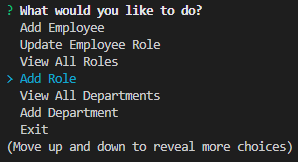

# Employee Tracker

## Description

This command line application allows the user to view and manage information stored in a database. The user chooses what they would like to do with the information by making use of [inquirer](https://www.npmjs.com/package/inquirer) prompts. The information is viewed and managed with [mysql2](https://www.npmjs.com/package/mysql2). Information was displayed using [console.table](https://www.npmjs.com/package/console.table) to format the output in a more readable fashion.


https://user-images.githubusercontent.com/50060256/197904711-a4a8d71d-225d-445b-8f5f-fdb4b0f82428.mp4


Inquirer is used to allow the user to choose between many options of ways to look and modify data stored in the database. It also allows for the user to give input that will be written into the database.




Shown below is mysql2 connecting to the database before anything happens runs so that we can are able to view and modify data. 

```js
const db = mysql.createConnection(
    {
        host: 'localhost',
        user: 'root',
        password: `${process.env.MYSQL_PASS}`,
        database: 'departments_db'
    }
);
```

## Technologies Used

- [Visual Studio Code](https://code.visualstudio.com/)
- [Github](https://github.com/)
- [Node JS](https://nodejs.org/dist/latest-v16.x/docs/api/)
- [Inquirer](https://www.npmjs.com/package/inquirer)
- [mysql2](https://www.npmjs.com/package/mysql2)
- [console.table](https://www.npmjs.com/package/console.table)
- [dotenv](https://www.npmjs.com/package/dotenv)
